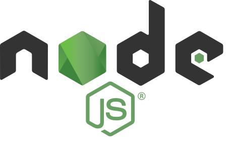

# Iván Durán

I'm a former sciences high-school teacher :man_teacher: eager to face new challenges and recurve my profesional career.

I had had previously contact with the programming world teaching basic robotics (with We-Do kits and arduino with Bit-Block)
to 6-12 years old students in extracurricular classes and in large workshops in malls(including a huge event during Christmas in Goya's square (Madrid) with more than 100 participants :speaking_head:

Now, I've decided to take a step forward, recurve and get myself some serious formation through the ISDI Coders full-stack web developer bootcamp.

> **_This profile is a work in progress..._**

## Tools I'm learning

|||||  |  |  |  |  | |

|:---:|:---:|:---:|:---:|:---:|:---:|:---:|:---:|:---:|:---:|
